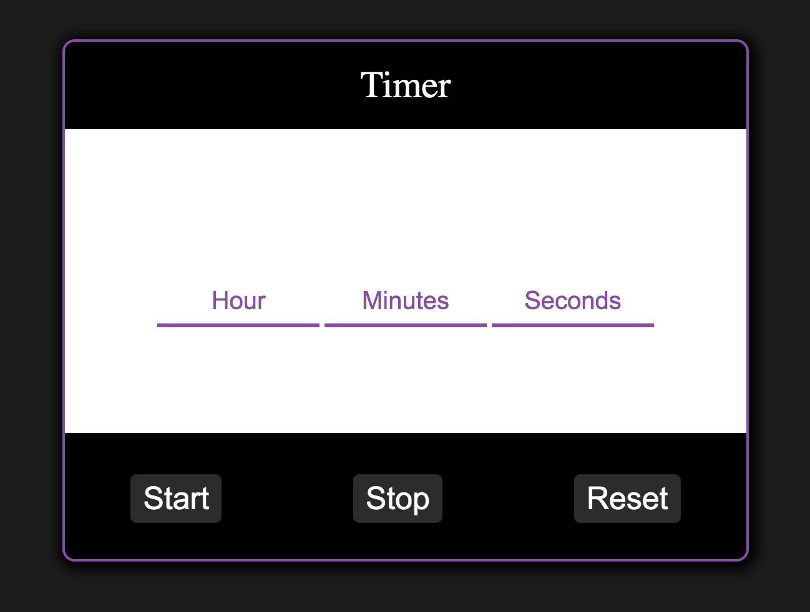

# Teast task for amoCRM

## Задание 1

Напишите реализацию таймера.

Шаг анимации таймера 1 секунда.

Форматирование таймера “hh:mm:ss”.

Например 01:12:59 - один час, 12 минут, 59 секунд.
___
### Мой вариант таймера
Примечания:

1. Вообще можно было бы просто поставить type="number" для input. Тоже бы печатались только цифры, но раз вы просили реализовать это отдельной функций, сделал это и в своем варианте.

Добавил кнопки Reset и Stop, что на мой взгляд в том или ином виде должно присутствовать в втаких вещах. Ну и немного стилизовал.

Поле вывода разбито на три зоны: Часы, минуты, секунды, что понятно любому юзеру и избавляет от необходимости прописвать лишние слова. Так приложение становится более универсальным и понятным для любого человека.
___